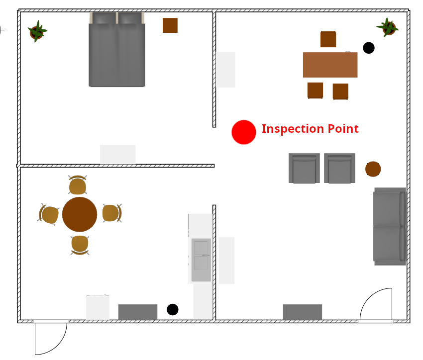
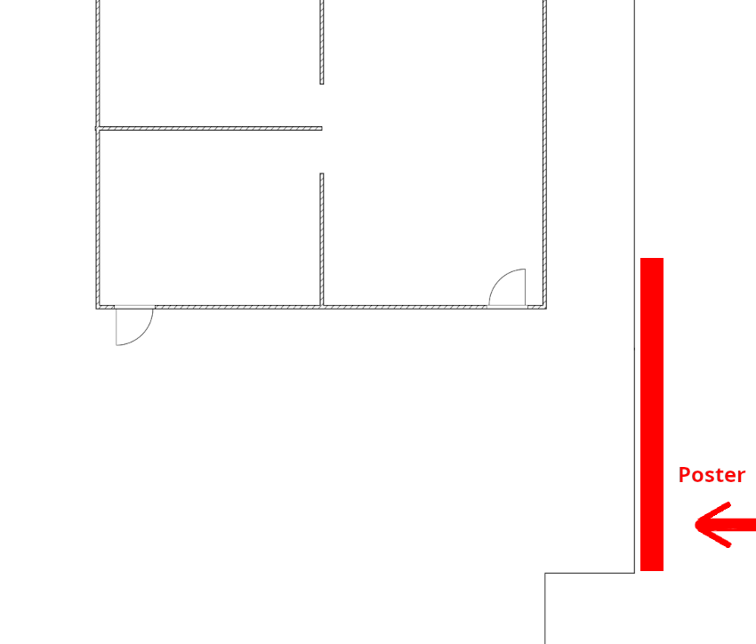
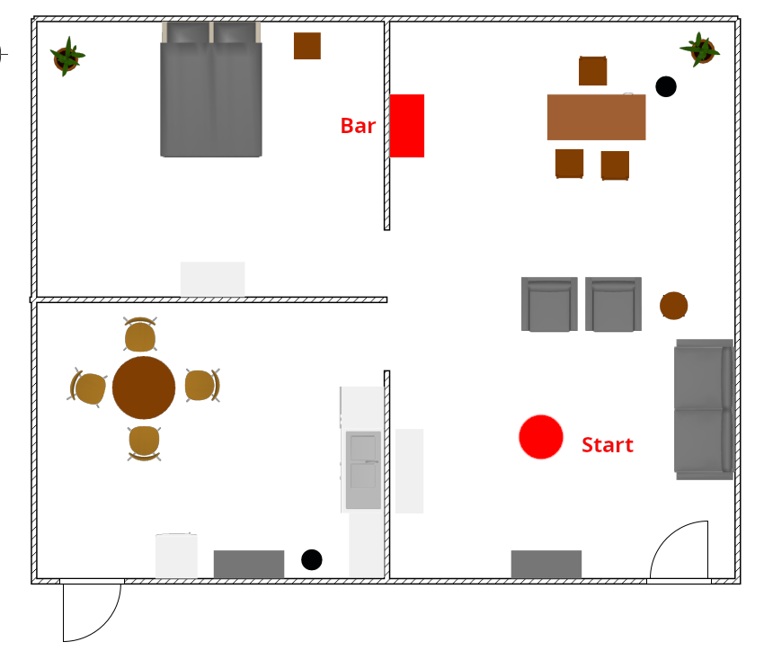
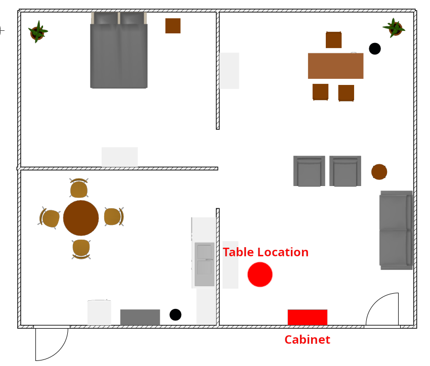
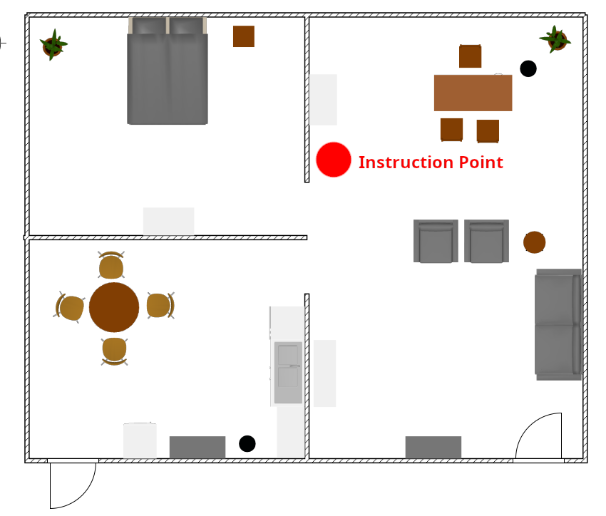
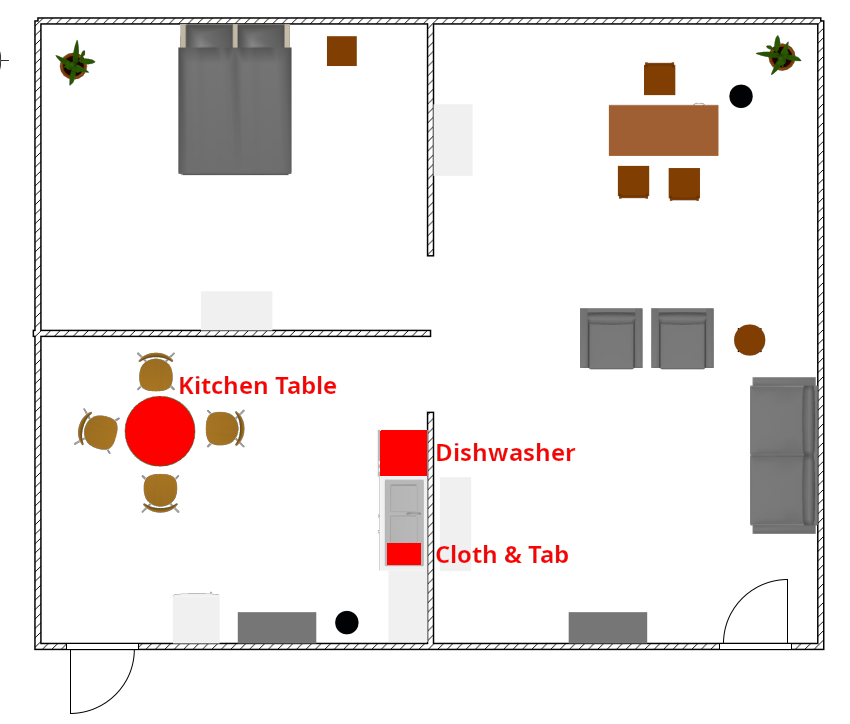

# Salvador 2025

## Table of Contents

- [Scores](#scores)
- [Schedule](#schedule)
    + [Arena OPL Mapping Slots](#arena-opl-mapping-slots)
    + [Arena DSPL Mapping Slots](#arena-dspl-mapping-slots)
- [Arenas](#arenas)
    + [OPL Teams](#opl-teams)
    + [DSPL Teams](#dspl-teams)
    + [Arena Map](#arena-map)
- [Additional Information](#information)
- [Robot Inspection and Poster Session](#robot-inspection-and-poster-session)
- [Stage 1](#stage-1)
    + [Receptionist](#receptionist)
    + [Storing Groceries](#storing-groceries)
    + [Help Me Carry](#help-me-carry)
    + [GPSR](#gpsr)
- [Stage 2](#stage-2)
    + [Clean the Table](#clean-the-table)
    + [Give Me a Hand](#give-me-a-hand)
    + [EGPSR](#egpsr)

## Scores

Team rankings and total scores

### OPL

The 8 best Teams will qualify for stage 2.

|      Team       | Total Score |
| --------------- | ----------: |
| Tidyboy-OPL     |        3675 |
| FAMBOT          |        1898 |
| NimbRo@Home     |        1616 |
| LASR            |        1187 |
| PyLoT Robotics  |         834 |
| FBOT@Home       |         483 |
| RoBorregos      |         463 |
| Tinker          |         200 |
| RoboFEI@Home    |          35 |
| UTBots          |          32 |
| Andesrobot Team |          29 |
| BahiaRT         |          28 |
| PMEC@HOME       |          26 |

Individual Task scores can be found [here](scores_opl.md)

### DSPL

All Teams qualify for stage 2.

|         Team          | Total Score |
| --------------------- | ----------: |
| Hibikino-Musashi@Home |        2619 |
| RoboCanes-VISAGE      |        1110 |
| UT Austin Villa@Home  |         805 |
| rUNSWeep              |         155 |

Individual Task scores can be found [here](scores_dspl.md)

## Schedule

|     | Tue July 15 | Wed July 16 | Thu July 17 | Fri July 18 | Sat July 19 | Sun July 20 |
|-----|------------|------------|------------|------------|------------|------------|
|09:00| | Mapping   |  | GPSR  | Restaurant | |
|10:00| | Mapping  |  | GPSR | Restaurant | |
|11:00| | Mapping  |  | GPSR | Restaurant | |
|12:00| | |  | |  | Finals |
|13:00| | | Receptionist | Help me Carry | Give Me a Hand | Finals |
|14:00| | | Receptionist  | Help me Carry  | Give Me a Hand | |
|15:00| Team Leader Meeting | | Receptionist  | Help me Carry | 15:00 RoboCup All Leagues Photo |  |
|16:00| | Opening Ceremony | |  | | Major Award Ceremony |
|17:00| Mapping | Poster / Robot Inspection | Storing Groceries | Clean the Table | EGPSR  | |
|18:00| Mapping | | Storing Groceries | Clean the Table | EGPSR | Major Party |
|19:00| Mapping | Team-Leader Meeting | Storing Groceries | Team-Leader Meetin | EGPSR | Major Party |
|20:00| | Reception (bring your own stuff) | Team-Leader Meeting |  | | Major Party |

Team Leader Meetings inside OPL Arena. Bring your own chair.

### Restaurant
| Sat July 19 9:00 | Team Name                    | League |
| ---------------- | ---------------------------- | ------ |
| 1                | Hibikino-Musashi\@Home       | DSPL   |
| 2                | Tinker                       | OPL    |
| 3                | RoboCanes-VISAGE + PUMAS TID | DSPL   |
| 4                | FBOT\@Home                   | OPL    |
| 5                | PyLoT Robotics               | OPL    |
| 6                | UT Austin Villa\@Home        | DSPL   |
| 7                | RoBorregos                   | OPL    |
| 8                | rUNSWeep                     | DSPL   |
| 9                | LASR                         | OPL    |
| 10               | FAMBOT                       | OPL    |
| 11               | NimbRo\@Home                 | OPL    |
| 12               | Tidyboy-OPL                  | OPL    |


### Give Me a Hand
| Sat July 19 13:00 | Team Name      | League |
| ----------------- | -------------- | ------ |
| 1                 | RoBorregos     | OPL    |
| 2                 | Tidyboy-OPL    | OPL    |
| 3                 | PyLoT Robotics | OPL    |
| 4                 | FBOT\@Home     | OPL    |
| 5                 | Tinker         | OPL    |
| 6                 | FAMBOT         | OPL    |
| 7                 | LASR           | OPL    |
| 8                 | NimbRo\@Home   | OPL    |

### Give Me a Hand
| Sat July 19 13:00 | Team Name                    | League |
| ----------------- | ---------------------------- | ------ |
| 1                 | Hibikino-Musashi\@Home       | DSPL   |
| 2                 | UT Austin Villa\@Home        | DSPL   |
| 3                 | rUNSWeep                     | DSPL   |
| 4                 | RoboCanes-VISAGE + PUMAS TID | DSPL   |


### EGPSR
| Sat July 19 17:00 | Team Name      | League |
| ----------------- | -------------- | ------ |
| 1                 | Tinker         | OPL    |
| 2                 | FBOT\@Home     | OPL    |
| 3                 | RoBorregos     | OPL    |
| 4                 | NimbRo\@Home   | OPL    |
| 5                 | PyLoT Robotics | OPL    |
| 6                 | LASR           | OPL    |
| 7                 | Tidyboy-OPL    | OPL    |
| 8                 | FAMBOT         | OPL    |

### EGPSR
| Sat July 19 17:00 | Team Name                    | League |
| ----------------- | ---------------------------- | ------ |
| 1                 | rUNSWeep                     | DSPL   |
| 2                 | RoboCanes-VISAGE + PUMAS TID | DSPL   |
| 3                 | Hibikino-Musashi\@Home       | DSPL   |
| 4                 | UT Austin Villa\@Home        | DSPL   |


### Clean the Table (OPL Arena)

| Thu July 17 17:00 | Team Name      | League |
| ----------------- | -------------- | ------ |
| 1                 | PyLoT Robotics | OPL    |
| 2                 | NimbRo\@Home   | OPL    |
| 3                 | Tinker         | OPL    |
| 4                 | LASR           | OPL    |
| 5                 | FBOT\@Home     | OPL    |
| 6                 | Tidyboy-OPL    | OPL    |
| 7                 | FAMBOT         | OPL    |
| 8                 | RoBorregos     | OPL    |


### Clean the Table (DSPL Arena)

| Thu July 17 17:00 | Team Name                      | League |
|-------------------|--------------------------------|--------|
| 1                 | UT Austin Villa@Home           | DSPL   |
| 2                 | Hibikino-Musashi@Home          | DSPL   |
| 3                 | RoboCanes-VISAGE + PUMAS TID   | DSPL   |
| 4                 | rUNSWeep                       | DSPL   |

### GPSR (OPL Arena)

| Thu July 18 9:00  | Team Name       | League |
| ----------------- | --------------- | ------ |
| 1                 | BahiaRT         | OPL    |
| 2                 | PyLoT Robotics  | OPL    |
| 3                 | PMEC\@HOME      | OPL    |
| 4                 | RoboFEI\@Home   | OPL    |
| 5                 | RoBorregos      | OPL    |
| 6                 | FBOT\@Home      | OPL    |
| 7                 | LASR            | OPL    |
| 8                 | Andesrobot Team | OPL    |
| 9                 | UTBots          | OPL    |
| 10                | Tidyboy-OPL     | OPL    |
| 11                | Tinker          | OPL    |
| 12                | FAMBOT          | OPL    |
| 13                | NimbRo\@Home    | OPL    |


### GPSR (DSPL Arena)

| Thu July 17 9:00 | Team Name                       | League |
|-------------------|--------------------------------|--------|
| 1                 | rUNSWeep                       | DSPL   |
| 2                 | UT Austin Villa@Home           | DSPL   |
| 3                 | Hibikino-Musashi@Home          | DSPL   |
| 4                 | RoboCanes-VISAGE + PUMAS TID   | DSPL   |


### Help Me Carry (Teams Area)

| Thu July 17 13:00 | Team Name                    | League |
| ----------------- | ---------------------------- | ------ |
| 1                 | RoboCanes-VISAGE + PUMAS TID | DSPL   |
| 2                 | BahiaRT                      | OPL    |
| 3                 | FAMBOT                       | OPL    |
| 4                 | PMEC\@HOME                   | OPL    |
| 5                 | UT Austin Villa\@Home        | DSPL   |
| 6                 | RoBorregos                   | OPL    |
| 7                 | rUNSWeep                     | DSPL   |
| 8                 | FBOT\@Home                   | OPL    |
| 9                 | Tidyboy-OPL                  | OPL    |
| 10                | RoboFEI\@Home                | OPL    |
| 11                | LASR                         | OPL    |
| 12                | Andesrobot Team              | OPL    |
| 13                | Tinker                       | OPL    |
| 14                | Hibikino-Musashi\@Home       | DSPL   |
| 15                | PyLoT Robotics               | OPL    |
| 16                | UTBots                       | OPL    |
| 17                | NimbRo@Home                  | OPL    |


### Store Groceries (OPL Arena)

| Thu July 17 17:00 | Team Name       | League |
| ----------------- | --------------- | ------ |
| 1                 | FBOT\@Home      | OPL    |
| 2                 | RoboFEI\@Home   | OPL    |
| 3                 | FAMBOT          | OPL    |
| 4                 | PMEC\@HOME      | OPL    |
| 5                 | BahiaRT         | OPL    |
| 6                 | Andesrobot Team | OPL    |
| 7                 | LASR            | OPL    |
| 8                 | Tinker          | OPL    |
| 9                 | Tidyboy-OPL     | OPL    |
| 10                | RoBorregos      | OPL    |


### Store Groceries (DSPL Arena)

| Thu July 17 17:00 | Team Name                  | League |
|-------------------|----------------------------|--------|
| 1                 | UT Austin Villa@Home       | DSPL   |
| 2                 | Hibikino-Musashi@Home      | DSPL   |
| 3                 | rUNSWeep                   | DSPL   |
| 4                 | RoboCanes-VISAGE + PUMAS   | DSPL   |


### Receptionist (OPL Arena)

| Thu July 17 13:00 | Team Name       | League |
| ----------------- | --------------- | ------ |
| 1                 | Tidyboy-OPL     | OPL    |
| 2                 | Andesrobot Team | OPL    |
| 3                 | RoBorregos      | OPL    |
| 4                 | NimbRo@Home     | OPL    |
| 5                 | RoboFEI@Home    | OPL    |
| 6                 | Tinker          | OPL    |
| 7                 | PyLoT Robotics  | OPL    |
| 8                 | UTBots          | OPL    |
| 9                 | LASR            | OPL    |
| 10                | BahiaRT         | OPL    |
| 11                | FAMBOT          | OPL    |
| 12                | FBOT@Home       | OPL    |
| 13                | PMEC@HOME       | OPL    |


### Receptionist (DSPL Arena)

| Thu July 17 13:00 | Team Name                  | League |
|-------------------|----------------------------|--------|
| 1                 | Hibikino-Musashi@Home      | DSPL   |
| 2                 | rUNSWeep                   | DSPL   |
| 3                 | RoboCanes-VISAGE + PUMAS   | DSPL   |
| 4                 | UT Austin Villa@Home       | DSPL   |


### Robot Inspection (OPL Arena)

| Wed July 16 17:00 | Team Name        | League |
|-------------------|------------------|--------|
| 1                 | FAMBOT           | OPL    |
| 2                 | PUMAS            | OPL    |
| 3                 | LASR             | OPL    |
| 4                 | BahiaRT          | OPL    |
| 5                 | PMEC@HOME        | OPL    |
| 6                 | PyLoT Robotics   | OPL    |
| 7                 | NimbRo@Home      | OPL    |
| 8                 | RoboFEI@Home     | OPL    |
| 9                 | RoBorregos       | OPL    |
| 10                | Tidyboy-OPL      | OPL    |
| 11                | FBOT@Home        | OPL    |
| 12                | UTBots           | OPL    |
| 13                | Tinker           | OPL    |
| 14                | Andesrobot Team  | OPL    |


### Robot Inspection (DSPL Arena)

| Wed July 16 17:00 | Team Name              | League |
|-------------------|------------------------|--------|
| 1                 | UT Austin Villa@Home   | DSPL   |
| 2                 | Hibikino-Musashi@Home  | DSPL   |
| 3                 | RoboCanes-VISAGE       | DSPL   |
| 4                 | rUNSWeep               | DSPL   |


### Arena OPL Mappig Slots

| Team Name (OPL) | Arena | Tue July 15 | Wed July 16 |
|--------------------|--------|--------------|--------------|
| NimbRo@Home        | OPL    | 17:00        | 11:10        |
| RoBorregos         | OPL    | 17:10        | 11:00        |
| LASR               | OPL    | 17:20        | 10:50        |
| RoboFEI@Home       | OPL    | 17:30        | 10:40        |
| FBOT@Home          | OPL    | 17:40        | 10:30        |
| Tinker             | OPL    | 17:50        | 10:20        |
| FAMBOT             | OPL    | 18:00        | 10:10        |
| UTBots             | OPL    | 18:10        | 10:00        |
| BahiaRT            | OPL    | 18:20        | 09:50        |
| PMEC@HOME          | OPL    | 18:30        | 09:40        |
| PyLoT Robotics     | OPL    | 18:40        | 09:30        |
| Tidyboy-OPL        | OPL    | 18:50        | 09:20        |
| PUMAS              | OPL    | 19:00        | 09:10        |
| Andesrobot Team    | OPL    | 19:10        | 09:00        |


### Arena DSPL Mapping Slots

| Team Name (DSPL) | Arena | Tue July 15 | Wed July 16 |
|-----------|-------|------|----|
| rUNSWeep              | DSPL | 17:00 | 10:30 |
| RoboCanes-VISAGE      | DSPL | 17:30 | 10:00 |
| Hibikino-Musashi@Home | DSPL | 18:00 | 09:30 |
| UT Austin Villa@Home  | DSPL | 18:30 | 09:00 |


## Arenas

### OPL Teams
|| Team Name (OPL) | Arena |
|----|----------------------------------------------------------------------------------------|--------|
| 1  | RoBorregos (Instituto Tecnologico y de Estudios Superiores de Monterrey, Mexico)      | OPL    |
| 2  | LASR (King’s College London, United Kingdom)                                           | OPL    |
| 3  | RoboFEI@Home (FEI University Center, Brazil)                                           | OPL    |
| 4  | FBOT@Home (Universidade Federal do Rio Grande (FURG), Brazil)                          | OPL    |
| 5  | Tinker (Tsinghua University, China)                                                    | OPL    |
| 6  | FAMBOT (Macau Pui Ching Middle School, China)                                          | OPL    |
| 7  | UTBots (Universidade Tecnológica Federal do Paraná, Brazil)                            | OPL    |
| 8  | BahiaRT (University of the State of Bahia, Brazil)                                     | OPL    |
| 9 | PMEC@HOME (Universidade Federal de Goiás, Brazil)                                      | OPL    |
| 10 | PyLoT Robotics (Kaijo Junior and Senior High School, Japan)                            | OPL    |
| 11 | Tidyboy-OPL (Pusan National University / Seoul National University, South Korea)       | OPL    |
| 12 | PUMAS (UNAM/TID/Tamagawa University, Mexico/Japan)                                     | OPL    |
| 13 | Andesrobot Team (UNAB Chile/USTA Colombia, Chile/Colombia)                             | OPL    |
| 14  | NimbRo@Home (University of Bonn, Germany)                                              | OPL    |


### DSPL Teams
|| Team Name (DSPL) | Arena |
|----|-----------------------------------------------------------------------------------------------|---------|
| 1  | Hibikino-Musashi@Home (Kyushu Institute of Technology and The University of Kitakyushu, Japan) | DSPL    |
| 2  | RoboCanes-VISAGE (University of Miami, USA)                                                   | DSPL    |
| 3  | UT Austin Villa@Home (The University of Texas at Austin, USA)                                | DSPL    |
| 4  | rUNSWeep (UNSW Sydney, Australia)                                                             | DSPL    |

## Information

- [Arena map](maps/arena.png)
- [Location names](maps/location_names.md)
- [Object List](objects/objects.md)
- [Additional Objects](objects/test_objects.md)
- [Names](names/names.md)
- Wifi 
    * ARENA_OPL_5G  PW: ```arenaopl```
    * ARENA_DSPL_5G PW: ```arenadspl```
- [Telegram Group for quick communications](https://t.me/+jKtw-HYUEiVhODJi)


## Robot Inspection and Poster Session


The Poster Session will be held next to the OPL arena. 



## Stage 1

### Receptionist


Host's name: Antonio
Host's favourite drink: Fanta
Host's interest: Rugby

### Storing Groceries


The tv stand (15) will be used as table
The cabinet (16) will be used as cabinet

### Help Me Carry
### GPSR

[Quiz Questions](questions.md)


## Stage 2

### Clean the Table


### Give Me a Hand


### EGPSR


